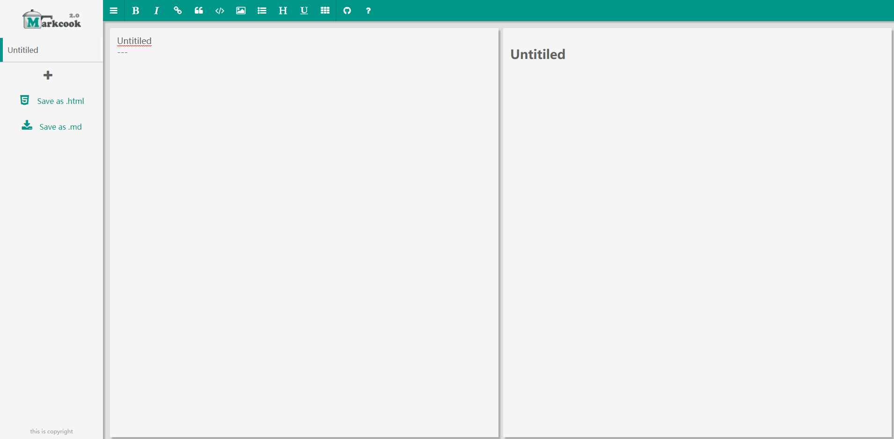
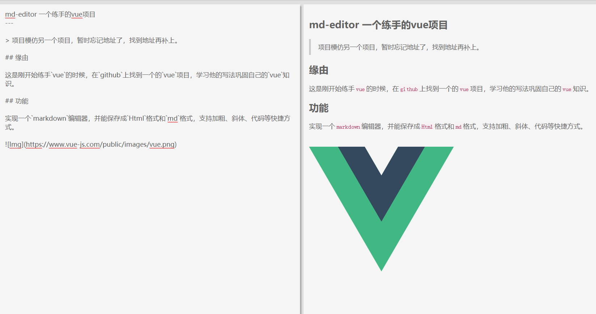

# md-editor 一个练手的vue编辑器项目

> 项目模仿另一个项目，暂时忘记地址了，找到地址再补上。 

## 缘由

这是刚开始练手`vue`的时候，在`github`上找到一个的`vue`项目，学习他的写法巩固自己的`vue`知识。

## 功能

实现一个`markdown`编辑器，并能保存成`Html`格式和`md`格式，支持加粗、斜体、代码等快捷方式。





## 缺陷

基本的编辑器功能都有了，持久化还没做，可以考虑后期用`localstorge`存下数据，避免刷新后又要重新写。

## 启动

```
// 安装依赖
npm i

// 启动开发
npm run dev

// 打包
npm run build
```


